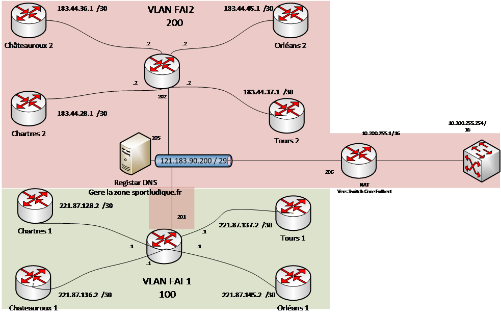

# Routeurs

## Présentation 

Un routeur est un dispositif essentiel dans les réseaux informatiques, permettant de connecter et de diriger le trafic entre différents réseaux. Sa principale utilité réside dans le routage des données, la séparation des réseaux et la gestion des flux d'information au sein des infrastructures informatiques.

## Infrastructure Publique simulée dans le labo du lycée Fulbert



## Mise en place du NAT/PAT (côté FIBRE)

### - Étape 1 : Accéder au mode de **configuration** 

Je me connecte au routeur Cisco en utilisant l'émulateur de terminal PuTTY car SSH a été ativé en amont.

### - Étape 2 : Activer le routing.

```js
R1_TRS# enable
R1_TRS(config)# ip routing
```

### - Étape 3 : Configurer le **NAT/PAT**

Je configure le **NAT/PAT** en utilisant l'interface spécifique où le trafic entrant est reçu (**GigabitEthernet0/0**) et l'interface connectée à Internet (**GigabitEthernet0/1**) :

```js
R1_TRS# configure terminal
R1_TRS(config)# interface gi0/0
R1_TRS(config-if)# 172.28.41.253 255.255.255.0
R1_TRS(config-if)# ip nat inside
R1_TRS(config-if)# no shutdown
exit

R1_TRS# configure terminal
R1_TRS(config)# interface gi0/1
R1_TRS(config-if)# 183.44.37.1 255.255.255.252
R1_TRS(config-if)# ip nat outside
R1_TRS(config-if)# no shutdown
exit
```

### - Étape 4 : Créer une liste d'accès (**ACL**)

Je crée une liste d'accès étendue qui spécifie les adresses IP privées à traduire en adresses IP publiques :

```js
R1_TRS(config)# ACCESS-LIST 1 PERMIT 172.28.32.0 0.0.31.255
```

L'expression "access-list 1 permit 172.28.32.0 0.0.31.255" définit une liste d'accès (ACL) sur un routeur Cisco pour permettre ou autoriser le trafic provenant de l'adresse IP spécifiée, 172.28.32.0, avec un masque de sous-réseau de 0.0.31.255. Cette ACL est configurée pour autoriser (permit) tout le trafic provenant de l'intervalle d'adresses 172.28.32.0 à 172.28.63.255.

### - Étape 5 : Configurer le **NAT/PAT**

Je configure le NAT/PAT en utilisant la liste d'accès (ACL) que j'ai créée :

```js
R1_TRS(config)# IP NAT INSIDE SOURCE LIST 1 INTERFACE GIGABYTE0/1 OVERLOAD
```

Spécifier la route par défaut.

```js
R1_TRS(config)# IP ROUTE 0.0.0.0 0.0.0.0 183.44.37.2
```

### - Étape 6 : Appliquer la configuration

```js
R1_TRS(config)# write memory
```

### - Étape 7 : Test

Un test de ping vers l'adresse IP 8.8.8.8, qui est associée aux serveurs DNS de Google, sert à vérifier la connectivité réseau entre votre appareil (généralement un ordinateur) et les serveurs de Google. Voici le résultat qu'on nous avons eu :

```js
R1_TRS#ping 8.8.8.8
Type escape sequence to abort.
Sending 5, 100-byte ICMP Echos to 8.8.8.8, timeout is 2 seconds:
!!!!!
```
