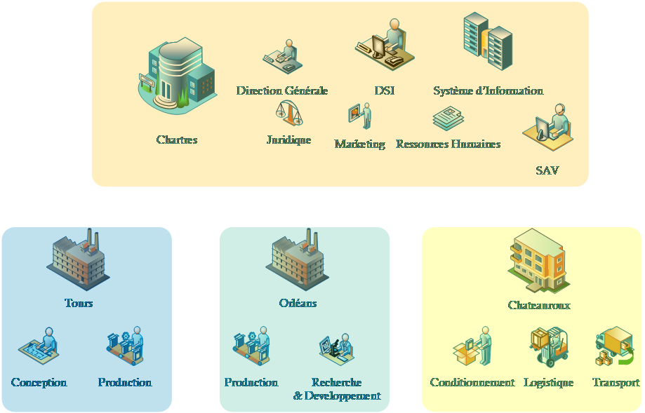

# **Documentation de Tours**

## Introduction

## Présentation générale de l’entreprise

## Activité

SportLudique SARL est une société implanté en région centre spécialisée dans la conception et la fabrication d’articles de sports et de loisirs composée de 452 personnes réparties autour de trois sites géographiques : Chartres, Tours, Orléans.

Elle dispose d’un quatrième site sur chateauroux suite à la mise en place d’une filiale spécialisée dans la logistique.

Le siège de SportLudique se situe dans l’agglomération chartraine.

Elle enregistre de bons résultats grâce à une gamme de produits complète (pour tous les âges) et connaît depuis peu un essor considérable proposant des installations clé en main aux collectivités

## Organigramme 

La Direction des Services Informatiques est sous la direction de Monsieur Claude Postic

Celui-ci a sous ses ordres 4 techniciens.

Le service RH est dirigé par Ms Helen Paisley-Le Bihan.

## Situation et répartition géographique

La société est articulée autour de quatre sites géographiques :

- le site de Chartres : il regroupe la direction, le marketing, les > finances, les ressources humaines et la direction des services > informatiques (DSI) ;

- le site d’Orléans : il regroupe l’usine de production des équipements extérieurs bois.

- le site de Tours : il regroupe le laboratoire de test et la > production des équipements plastique

- le site de Chateauroux : situé idéalement au centre de la France, > les stocks et la logistique sont la spécialité de ce site.

# Présentation de l’infrastructure Informatique

## Vu d’ensemble du Système d’Information

Le système d'information (SI) de SportLudique reflète la dynamique de l'entreprise : mis en place il y a quelques années, il a depuis connu une expansion considérable. SportLudique est divisée en quatre domaine windows autonomes, chacun opérant sur un site géographique distinct et controlé par un controleur de domaine indépendant.

En réponse à la croissance de l'activité et à divers projets informatiques, des serveurs Windows 2008 Server et Windows Server 2012 ont été intégrés au système. Cette initiative visait à renforcer la fiabilité et à ajouter des fonctionnalités, le tout sans perturber l'infrastructure existante.

L'architecture actuelle repose sur la virtualisation, mise en œuvre à travers VMWare Esxi, bien que la version utilisée soit la 5.0 en raison des licences disponibles.

Chaque site bénéficie de son propre département informatique, couvrant un large éventail de responsabilités allant de l'administration à l'assistance aux utilisateurs.

Les utilisateurs font partie du domaine Active Directory, bien qu'ils puissent parfois utiliser des comptes d'administration locaux (comme le compte install/install) pour installer des logiciels répondant à des besoins spécifiques. Ceci est en raison du fait que la gestion des configurations n'est pas centralisée au sein de la Direction des Systèmes d'Information (DSI) existante. Ils utilisent diverses applications adaptées à leurs activités, notamment des suites bureautiques telles que LibreOffice, ainsi que des outils graphiques ou des applications internes développées au sein de l'entreprise.