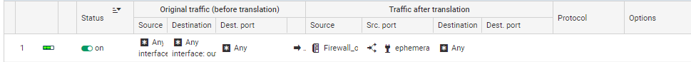

# **Configuration du Firewall**

## Installation

# Etape 1 : Se connecter au Firewall

Nous le connectons sur le PC pour la premiere utilisation.

Nous accedons au firewall pour la premiere fois via un l'IP 10.0.0.254/8.
Nous devons donc changer l'ip du poste dans l'adresse ip du Firewall, puis nous avons juste a ouvrir un navigateur tel que Google et se connecter au firewall via l'URL ""https://10.0.0.254/admin""

# Etape 2 : Activation de License 

Pour activer la License il nous suffit de ce rendre dans "SYSTEM -> LICENSE", puis on ajoute la Licence (au préalable récuperer au près de Mr Mery).

# Etape 3 : Formatage de la carte SD

Pour Formater la carte SD nous nous rendons dans "NOTIFICATION -> Logs" puis on choisi notre carte SD, puis on Format.

# Etape 4 : Parametres du Firewall

On décide de changer le mot de passe Admin.
Pour ce faire nous nous rendons

# Etape 5 : Paramétrages Interfaces

Pour parametres les interfaces on se rend dans "NETWORK -> Interfaces" puis nous configurons nos interfaces In et Out.

On mes des ip static sur chaque interfaces puis nous ajoutons la passerelle par default qui nous serviras a sortir (passerelle routeur).

## Etape 6 : Passerelle par defaut

On ajoute la "Default Gateway" dans l'onglet "Network -> Routing".

On crée un nouvel objet en tant que **Routeur** en ajoutant notre passerelle pour sortir du Parefeu vers les Routeurs.

On peut tester un ping vers Google "8.8.8.8" sur le pc et le Firewall en faisant la commande :  

    SYSTEM PING host="adresse ip de l'hote".

## Etape 7 : Règles de Filtrages et de NAT

Pour le moment nous choissirons le type de filtrage en "Pass All" pour pouvoir faire nos test.

On ajoute une régle de NAT Dynamique qui va nous permettre de Naté une première fois via le Firewall avant les routeurs.

 

## Etape 8 : Route Statique

On ajoute les routes des sous réseaux de Production et de Conception, en définissant bien les réseaux en "Network" et non en "Hote" et la "Gateway" en "Routeur" et non un "Hote".

