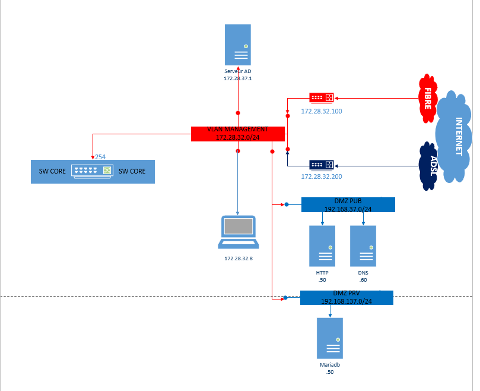

# **Infrastructure de Tours**

## Infrastructure

| Nombre d'utilisateurs | 179 |
|-|-|
| Nombres de stations de travail | 95 |
| Fixes | 90 |
| Portables | 5 |
| Nombre de serveus | 10 |

## Plan d'adressage

| Nom | Adresse réseau | Masque (CIDR, Binaire) | Broadcast |
|-|-|-|-|
| Chateauroux | 172.28.0.0 | /19 255.255.224.0 | 172.28.31.255 |
| Tours | 172.28.32.0 | /19 255.255.224.0 | 172.28.63.255 |
| Chartres | 172.28.64.0 | /19 255.255.224.0 | 172.28.95.255 |
| Orléans | 172.28.96.0 | /19 255.255.224.0 | 172.28.127.255 |

##  VLAN Tours

| VLAN | Adress réseau + CIDR | Plage d'adresse | Broadcast | Service | 
|-|-|-|-|-|
| 220 | 172.28.32.0 /24 | 172.28.32.1 - 172.28.32.254 | 172.28.32.255 | Management |
| 221 | 192.168.37.0 /24 | 192.168.37.1 - 192.168.37.254 | 192.168.37.255 | DMZ PUB |
| 222 | 172.28.37.0 /24 | 172.28.37.1 - 172.28.37.254 | 172.28.37.255 | Serveur |
| 223 | 192.168.137.0 /24 | 192.168.137.1 - 192.168.137.254 | 192.168.137.255 | DMZ PRV |
| 224 | 172.28.36.0 /24 | 172.28.36.1 - 172.28.36.254 | 172.28.36.255 | ... |
| 225 | 172.28.34.0 /24 | 172.28.34.1 - 172.28.34.254 | 172.28.34.255 | ... |
| 226 | 172.28.38.0 /24 | 172.28.38.1 - 172.28.38.254 | 172.28.38.255 | Conception | 
| 227 | 172.28.39.0 /24 | 172.28.39.1 - 172.28.39.254 | 172.28.39.255 | Production |
| 228 | 172.28.40.0 /24 | 172.28.40.1 - 172.28.40.254 | 172.28.40.255 | Transport-firewall |
| 229 | 172.28.41.0 /24 | 172.28.41.1 - 172.28.41.254 | 172.28.41.255 | Transport-routeur |

| Port | Vlan |
|-|-|
| gi0/1 - gi0/2 | 220 |
| gi0/6 - gi0/8 | 221 |
| gi0/3 - gi0/4 | 222 |
| gi0/13 | 226 |
| gi0/14 | 227 |
| gi0/18 - gi0/20 | 228 |
| gi0/15 - gi0/17 - gi0/19 - gi0/21 | 229 |

## Plan d'adressage de Tours

## Plan d'adressage Vlan Management

## Câblage Infrastructure

## Port attribuer au switch

## Détails des équipements serveurs

| Nom | Fonction | OS |
|-|-|-|
| TRS_DC_01 | Contrôleur principal de domaine | Windows server 2008 R2 |
| | Serveur primaire DNS | Domaine : tour.local |
| | Serveur DHCP | |
| | Serveur de fichiers | |
| TRS_DC_02 | Controleur secondaire de domaine | Windows server 2008 R2 |
| | Serveur secondaire DNS | |
| | Serveur de fichiers répliqué | |
