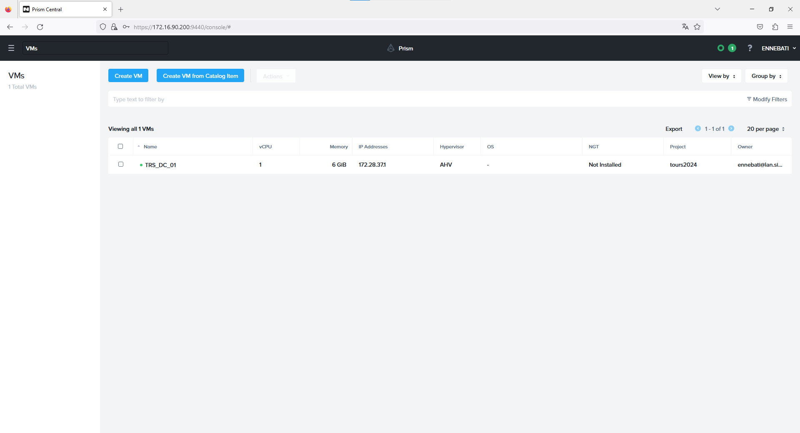
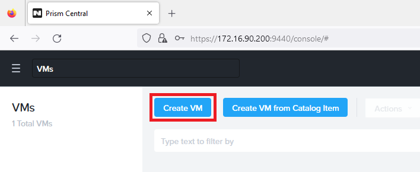

# **Nutanix**

## Présentation 
**Nutanix** est une solution informatique révolutionnaire qui simplifie considérablement la gestion de l'infrastructure informatique et des réseaux pour les entreprises. Elle est particulièrement pertinente pour les administrateurs réseau qui cherchent à optimiser la création et **la gestion de machines virtuelles (VM) tout en assurant une administration réseau efficace.**

## Initialisation à Nutanix

- Étape 1 : Accéder à l'URL fournie par votre professeur 

(*https://172.16.90.200:9440*)

- Étape 2 : Authentification sur la plateforme Nutanix 

Login : "nom"@lan.sio.lyceefulbert.fr

Mot de passe : "Mdp de lan.sio.lyceefulbert.fr"

- Étape 3 : Accéder au tableau de bord Nutanix

- Étape 4 : Création de votre machine virtuelle (VM)

## Création de la machine virtuelle

- Étape 1 : Donner un nom à la VM

Donner un nom significatif à la machine virtuelle, ici on utilise "TRS_DC_01" (Tours_Domaine Controller_Numéro 1). Cela permettra de l'identifier facilement dans notre environnement virtuel.

- Étape 2 : Attribution de la mémoire RAM

Augmenter la quantité de RAM de la VM à 6 Go. Par défaut, il y a 4 Go de RAM, mais nous pouvons augmenter cette valeur pour répondre aux besoins de notre VM.

- Étape 3 : Ajouter l'ISO de Windows Server 2022

Ajouter l'ISO de Windows Server 2022 à la VM. Utilisez l'ISO nommé "fr-fr_windows_server_2022_updated_aug_2023_x64_dvd_78639bda.iso" fourni par le professeur. Cela permettra de démarrer la VM à partir de cet ISO pour l'installation de Windows Server 2022.

- Étape 4 : Ajouter l'ISO de Nutanix

Ajouter également l'ISO de Nutanix à la VM. Utilisez l'ISO nommé "Nutanix-VirtIO-1.2.1.iso" fourni par votre professeur. Cette étape est importante pour la configuration de la VM avec les pilotes et les outils nécessaires.

- Étape 5 : Ajouter un disque de 50 Go

Ajouter un disque supplémentaire de 50 Go à la VM. Ce disque servira à stocker des fichiers, notamment les ISO que nous avons ajoutés précédemment.

- Étape 6 : Attacher un sous-réseau VLAN

Associer un sous-réseau VLAN à la VM. On utilise le VLAN 222 qui a été précédemment configuré pour le serveur. Cette étape permet à la VM d'être connectée au réseau correct.

- Étape 7 : Activer "Use this VM as an agent VM"

Cocher la case "Use this VM as an agent VM". Cela indique à la VM de fonctionner en tant que VM agent, ce qui peut être nécessaire pour certaines fonctionnalités de gestion spécifiques à Nutanix.

- Étape 8 : Créer la VM et suivre les étapes d'installation de Windows

Enfin, créer la VM. Une fois la VM créée, démarrez-la à partir de l'ISO de Windows Server 2022 et suivez les étapes d'installation de Windows, en veillant à configurer les paramètres réseau et autres paramètres selon vos besoins. Sans oublier de sélectionner les hyperviseurs de Nutanix dans le dossier /Windows 2022/64x

