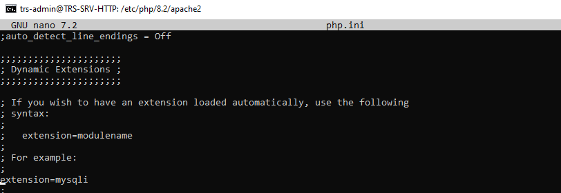

# **Wordpress**

## Installation

- Etape 1 : Télechargement du paquet Wordpress 

On télécharge le paquet wordpress grace a la commande

    cd /tmp 
    wget https://wordpress.org/latest.zip

- Etape 2 : Création d'une basse de donnée Mariadb

On creer une VM Debian 11 avec dessus Mariadb qui va servir de base de donnée pour le wordpress

    mysql -u root -p

On créer la base de donnée 'blog'

    CREATE DATABASE blog;

On créer un utilisateur avec les droits sur la base de donnée

    CREATE USER 'Trswp'@'%' IDENTIFIED BY 'Votre-Super-Mot-De-Passe';

% = donne l'accès a tous les hotes est donc moin sécuriser, on devrais mettre l'adresse ip de notre serveur HTTP '192.168.37.50'

On donne a l'utilisateur tous les droits 

    GRANT ALL PRIVILEGES ON blog.* TO 'Trswp'@'%';

on actualise les droits avec la commande

    FLUSH PRIVILEGES;

On doit changé le Bind Address qui permet de lié une adresse ip 

    sudo nano etc/mysql/mariadb.conf.d/50-server.cnf

    bind-address        = 0.0.0.0 (autorise toutes les connexions)
                        = 192.168.37.50 (autorise la connexions avec l'hôte)

- Etape 3 : Décompressage de l'archive wordpress

on créer le fichier wordpress dans lequelle on va décompresser l'archive

    sudo rm /var/www/html/wordpress

On installe l'extension Zip

    sudo apt-get install zip

Ensuite on décompresse 

    sudo unzip latest.zip -d /var/www/wordpress

On ce déplace dans le dossier 

    cd /var/www/wordpress

On déplace tous le contenu du dossier wordpress a la racine du site

    sudo mv wordpress/* /var/www/wordpress/

Ensuite on donne les droits a l'utilisateur de notre serveur Apache

    sudo chown -R trs-admin:www-data /var/www/wordpress/

- Etape 4 : Installation de Wordpress

On se connecte a l'interface web avec l'adresse 'http://IP-SERVEUR'

Si vous n'arriver pas a accédes a la page d'installation vous devez vous rendre sur votre serveur HTTP et ce rendre dans le fichier 'php.ini' et retirer le ; devant la ligne 'extension=mysqli'

On ajoute les informations 

Nom de la base de données : dans cet exemple, ce sera "blog"
Identifiant : le nom de l'utilisateur qui a les droits sur la base de données, en l'occurrence "Trswp"
Mot de passe : le mot de passe de cet utilisateur
Adresse de la base de données : si le serveur Web et la base de données ne sont pas sur le même serveur, indiquez l'adresse IP du serveur distant '192.168.137.50'

On envoie les informations pour que wordpress essaie de se connecter a la base de donnée.
Si jamais Wordpress n'y arriver pas, vous devez ajouter un Enregistrement CNAME sur votre serveur DNS qui est dans le Vlan Serveur.

Nom de l'alias : blog
Nom de domaine : blog.tours.sportludique.fr
Nom de domaine complet : www.tours.sportludique.fr.

Et On suit l'installation après ça.